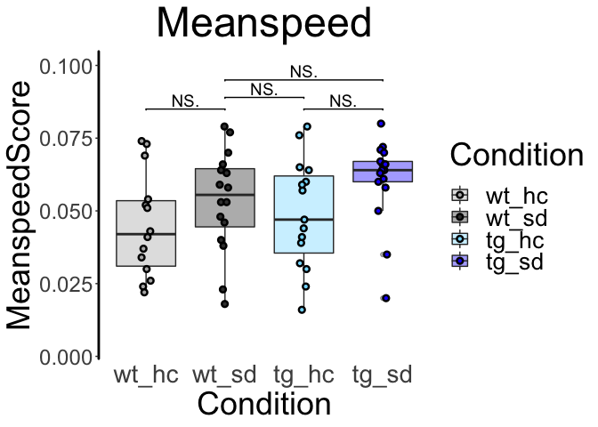
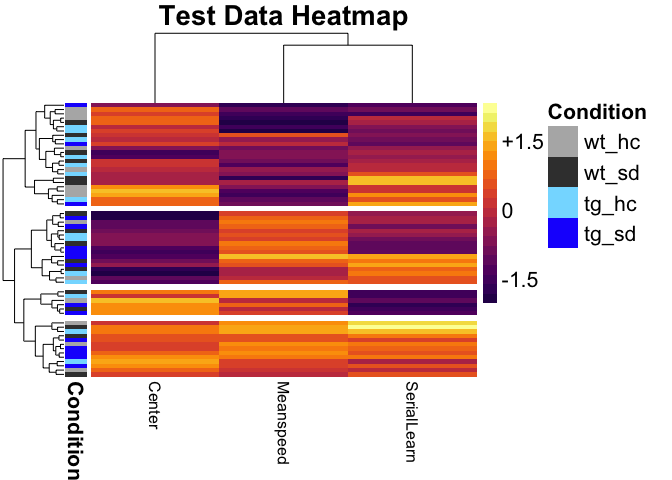

ReadMe for ntbgraphics
================

This package includes functions for importing, transforming and
visualization of NTB datasets:

  - ‘*getexpdata*’ for import of the Animal List (containing animal
    RFIDs, corresponding Genotypes and optionally Environment) and Meta
    Behavior (containing animals and their behavioral measures) as well
    as formal preparation;
  - ‘*ploteachexp*’ for plotting of given experiments as boxplots and
    exporting the result as a PDF file;
  - ‘*loopplotexp*’ for plotting all experiments within a dataset as
    boxplots and exporting the results in one PDF file;
  - ‘*heatmapexp*’ for plotting all experiments as a heatmap and
    producing a datamatrix with z-scored values.

All functions take a **directory** as their input, which specifies the
location of the **two files** “Animal List.xlsx” and “Meta
Behavior.xlsx” (mind correct spelling of these files - functions rely
on specific names\!). It is also important that you mind correct
**formatting** of your excel files. This includes:

  - at least three columns with information about ‘RFID’, ‘Genotype’ and
    ‘Environmental’ \[Condition\] in your Animal List with these exact
    titles;
  - at least three columns with information about ‘Animal’, ‘Meanspeed’
    and ‘SerialLearn’ in your Meta Behavior with these exact titles;
  - correct order of columns:
      - the Animal List does not require a certain order;
      - the Meta Behavior should list ‘Meanspeed’ as the very first and
        ‘SerialLearn’ as the very last of all behavioral experiments
        (only columns inbetween including the former will be considered
        for behavioral analysis) – ‘Animal’ might be at the very
        beginning or end, but not inbetween\!  

Furthermore, each function requires definition of the experimental setup
in terms of 4-arm or 2-arm design, respectively required type of
analysis (you may want to analyze your 4-arm experiment as 2-arm, only
looking at two conditions). The default setup assumes a 4-arm
experiment. Further aspects can be customized depending on the specific
function.

All functions externally work on their own, which means that they may
rely internally on one of the other functions of the package without the
user needing to run them in advance.  
  
  
 

The following plot shows the general layout you can expect from the
boxplot functions (‘ploteachexp’ and ‘loopplotexp’).  

<!-- -->  
  
 

The following map shows the general layout you can expect from the
‘heatmapexp’ function.  

<!-- -->
